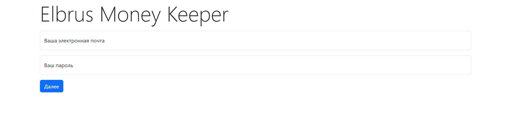
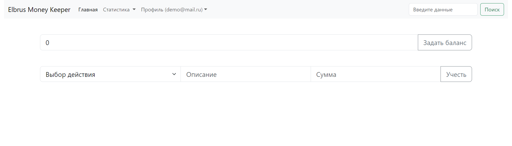
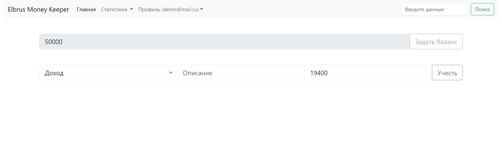
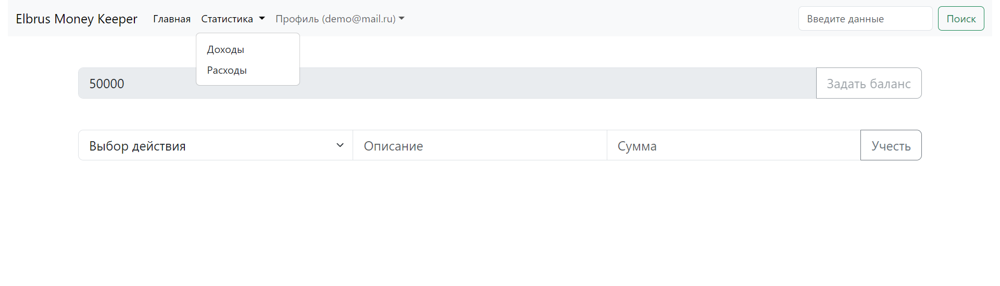
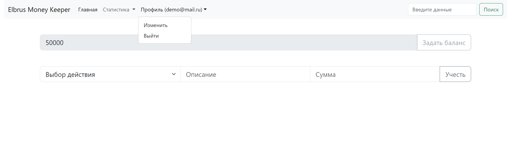
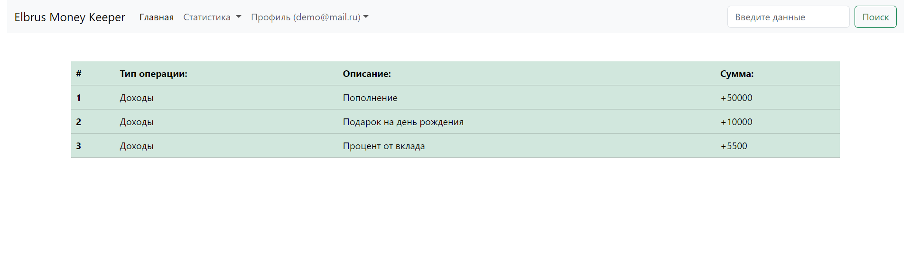
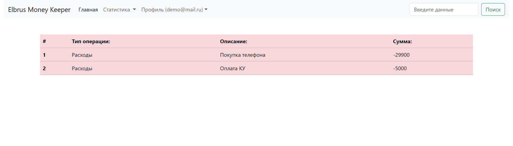

# Приложение учёта доходов и расходов Elbrus Money Keeper

## Описание проекта

Добро пожаловать в наш проект! 

Мы будем разрабатывать с нуля приложение для учёта доходов и расходов.
Твоя задача в первую очередь увидеть работу веб-разработчика изнутри, понять как формируется приложение и попрактиковаться в разработке на JavaScript. Возможно ты вообще никогда не имел(-ла) опыта в написании кода, но тебе очень хотелось попробовать, этот проект как раз для этого.

Итогом станет проект который будет работать на сервисе [GitHub Pages](https://pages.github.com/), в дальнейшем ты сможешь его улучшать и расширять по своему желанию.

## Необходимое ПО для реализации приложения:

- [Node.js](https://nodejs.org/en/download) (среда выполнения JavaScript с возможностью серверной разработки)
- [VS Code](https://code.visualstudio.com/) (популярный редактор кода с удобным функционалом)
- [Google Chrome](https://www.google.com/intl/ru_ru/chrome/) (браузер для просмотра и рзработки любых веб-приложений)
- [Git](https://git-scm.com/downloads) (программа для управления версиями твоего кода)

### Релиз 0: Определение стуктуры и декомпозиция задач

Декомпозиция — разбиение сложной задачи на более мелкие и управляемые подзадачи. 
Важно определить основные этапы выполнения задачи и разбить их на более простые шаги. 
Таким образом, проще контролировать процесс выполнения и обеспечить успешное завершение проекта.

Соответствено сейчас у тебя есть:
- папка `css` с файлом `bootstrap.min.css` c миницифированным css-кодом из фреймворка [Bootstrap](https://getbootstrap.com/), который используется для основной стилизации приложения. Для собственной реализации стилей используй файл `style.css`.
- папка `img` с заготовленными файлами изображений: `.png` для `favicon` (значок веб-сайта или веб-страницы)
- папка `js` с заготовленными файлами скриптов: `auth.js`, `dashboard.js`, `expenses.js`, `income.js`, `profile.js`, где будет написана вся логика твоего приложения на языке JavaScript
- папка `assets` с примерами интерфейса приложения `Elbrus Money Keeper`
- заготовленные файлы: `auth.html`, `dashboard.html`, `expenses.html`, `income.html`, `profile.html` для использования в приложении, также ты можешь использовать свои `.html` файлы

Важно учесть, что приложение нужно "развернуть" на сервисе [`GitHub Pages`](https://pages.github.com/) для этого нужно сделать ряд первичных действий:
- проверить что установлен сам `Git` с помощью команды в терминале: `git --version`, если после выполнения появится версия то `Git` установлен
- создать аккаунт в сервисе [`GitHub`](https://github.com/signup)

Любая разработка использует подход в виде релизов, каждый из которых выполняет поставленную задачу.
Это был вводый релиз.

### Релиз 1: Базовая аутентификация

Следующей задачей будет реализовать твою первую аутентификацию в приложение.
Кто-то уже знает что означает это слово, а кому-то нужно пояснить подробнее, что это процесс проверки пользователя для дальнешейго использовании в приложении. 
В нашем приложении за это будут отвечать файлы: `auth.html` и `auth.js`.

Из основных данных которые мы будем использовать в приложении это: `электронная почта/email` и `пароль/password`, для реализации сохранения введёных данных рекомендуем изучить свойство `localStorage`. С помощью него можно сохранить ранее ведённые данные для дальнейшего сравнения при последующих попытках входа. Более подробнее можно узнать [здесь](https://developer.mozilla.org/ru/docs/Web/API/Window/localStorage).

В файле `auth.html` есть пример кода для реализации формы которая будет обрабатывать введёные данные:

```html
<form class="mt-3" id="authForm" method="GET" action="/dashboard.html">
    <div class="form-floating mb-3">
        <input required name="email" type="email" class="form-control" placeholder>
        <label>Ваша электронная почта</label>
    </div>
    <div class="form-floating mb-3">
        <input required name="password" type="password" class="form-control" placeholder>
        <label>Ваш пароль</label>
    </div>
    <button type="submit" class="btn btn-primary">Далее</button>          
</form>
```

Пример страницы `auth.html`:


### Релиз 2: Функционал установки стартового баланса

Теперь когда приложение работает с пользовательскими данными нужно чтобы клиент перешёл на `Dashboard`

Пример страницы `dashboard.html`:


Пример страницы `dashboard.html` после установки баланса:


Пример страницы `dashboard.html` выпадающее меню статистики:


Пример страницы `dashboard.html` выпадающее меню профиля:



### Релиз 3: Форма учёта доходов и расходов
- Форма для учёта доходов и расходов

### Релиз 4: Разработка интерфейсов статистики
- Отдельные страницы со статистикой доходов и расходов

Пример страницы статистики доходов `income.html`:


Пример страницы статистики расходов `expenses.html`:


### Релиз 5: Первая реализация деплоя/развёртывания на GitHub Pages
- Отдельные страницы со статистикой доходов и расходов